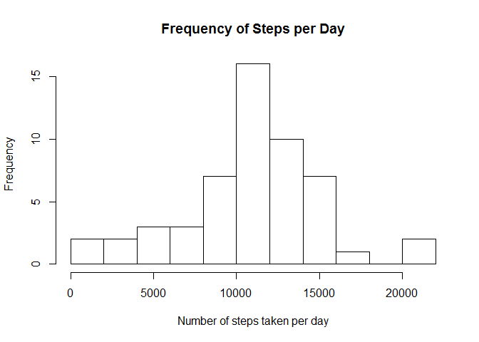
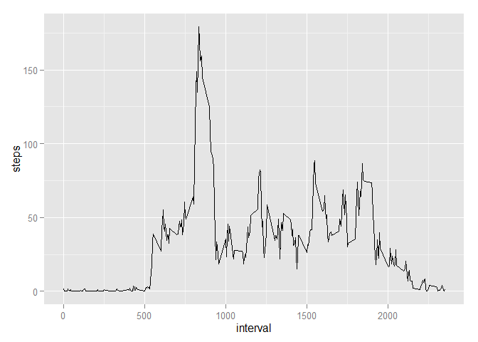
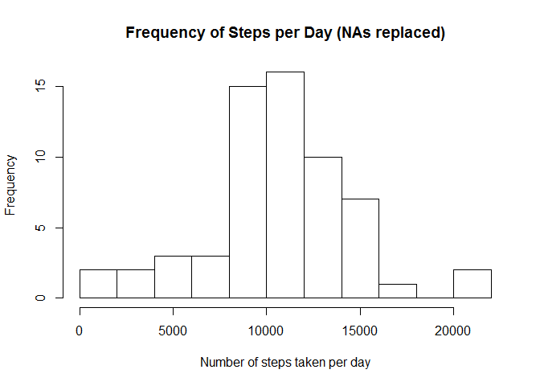

# Reproducible Research: Peer Assessment 1
## Loading and preprocessing the data

```r
setwd("C:/Users/Carl/Documents/Data Science Coursera/5 Reproducible Research/Assignment 1")
activity<-read.csv("activity.csv", stringsAsFactors = FALSE, header = TRUE)
```
## What is mean total number of steps taken per day?

```r
activityAgg<-aggregate(steps~date, activity, sum, na.rm=TRUE)
hist(activityAgg$steps,
     main = "Frequency of Steps per Day", 
     xlab = "Number of steps taken per day",
     breaks = 10)
```

 

```r
mean(activityAgg$steps, na.rm=TRUE)
```

```
## [1] 10766.19
```

```r
median(activityAgg$steps, na.rm=TRUE)
```

```
## [1] 10765
```
## What is the average daily activity pattern?

```r
library(plyr)
library(ggplot2)
StepAvg<-aggregate(activity$steps, by=list(activity$interval),sum,na.rm=TRUE)
StepAvg<-rename(StepAvg, c("Group.1"="interval", "x"="steps"))
StepAvg$steps<-StepAvg$steps/length(unique(activity$date))
qplot(interval, steps, data=StepAvg, geom=c("line"))
```

 

```r
StepAvg[StepAvg$steps>trunc(max(StepAvg$steps)),]
```

```
##     interval    steps
## 104      835 179.1311
```
## Imputing missing values

```r
sum(is.na(activity$steps)) ##total number missing values
```

```
## [1] 2304
```

```r
activity2<-activity
activity2$steps[is.na(activity$steps)]<-StepAvg$steps ## take average steps in interval
activity2Agg<-aggregate(steps~date, activity2, sum, na.rm=TRUE)
hist(activity2Agg$steps, 
     main = "Frequency of Steps per Day (NAs replaced)", 
     xlab = "Number of steps taken per day",
     breaks = 10)
```

 

```r
mean(activity2Agg$steps, na.rm=TRUE)
```

```
## [1] 10581.01
```

```r
median(activity2Agg$steps, na.rm=TRUE)
```

```
## [1] 10395
```
## Are there differences in activity patterns between weekdays and weekends?

```r
activity2$day<-weekdays(as.POSIXlt(activity2$date))
activity2$weekpt<-"weekday"
activity2$weekpt[activity2$day=="Sunday" | activity2$day=="Saturday"]<-"weekend"

StepAvgPt<-aggregate(activity2$steps, 
                     by=list(activity2$interval, activity2$weekpt),
                     sum,na.rm=TRUE)
StepAvgPt<-rename(StepAvgPt, c("Group.1"="interval", "Group.2"="weekpt", "x"="steps"))
StepAvgPt$steps<-StepAvgPt$steps/length(unique(activity2$date))
ggplot(StepAvgPt, aes(interval, steps))+geom_line()+facet_wrap(~weekpt, nrow=2)
```

 
